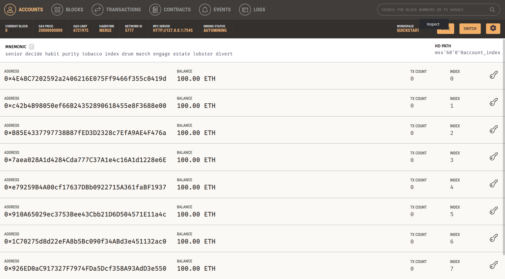

<h2 align="center">
    <a href="https://dainam.edu.vn/vi/khoa-cong-nghe-thong-tin">
    🎓 Faculty of Information Technology (DaiNam University)
    </a>
</h2>

<h2 align="center">
GIÁM SÁT NĂNG LƯỢNG VÀ SA THẢI PHỤ TẢI TOÀ NHÀ THÔNG MINH BẰNG BLOCKCHAIN
</h2>

<div align="center">

<p align="center">


</p>

[](https://www.facebook.com/DNUAIoTLab)
[](https://dainam.edu.vn/vi/khoa-cong-nghe-thong-tin)
[](https://dainam.edu.vn)

</div>

---

## 📌 Poster dự án

<div align="center">

</div>

---

# 📖 Giới thiệu đề tài

**Giám sát năng lượng và sa thải phụ tải tòa nhà thông minh bằng Blockchain** là hệ thống kết hợp giữa **Internet vạn vật (IoT)** và **Blockchain Ethereum** nhằm xây dựng một nền tảng quản lý, giám sát công suất tiêu thụ điện năng thời gian thực và tự động điều phối an toàn lưới điện nội bộ một cách minh bạch, bất biến.

Hệ thống sử dụng cảm biến dòng điện để thu thập thông số, áp dụng vi điều khiển ESP8266 để tính toán toán học và điều khiển cơ cấu chấp hành ngắt tải phụ khi có sự cố. Toàn bộ dữ liệu biến động và nhật ký quá tải sẽ được mã hóa hóa và đóng gói trực tiếp vào sổ cái của mạng Blockchain thông qua thư viện Web3.js, triệt tiêu hoàn toàn rủi ro can thiệp hay xóa sửa dữ liệu thủ công.

🎯 **Mục tiêu của hệ thống**

* Giám sát liên tục và tính toán công suất tiêu thụ điện năng theo thời gian thực.
* Tự động kích hoạt cơ chế sa thải phụ tải (Load Shedding) bảo vệ hệ thống khi vượt ngưỡng an toàn.
* Phát tín hiệu cảnh báo khẩn cấp đa kênh (Mail thông báo qua giao thức mã hóa bảo mật SSL).
* Lưu trữ nhật ký biến động công suất và sự cố lên mạng lưới Blockchain Ethereum cục bộ.
* Triển khai cơ chế khôi phục trạng thái (Reverse Scan) từ chuỗi khối, chứng minh tính toàn vẹn dữ liệu.

---

# ⚙️ Tính năng nổi bật

* 📊 Realtime Energy Stream (Cập nhật liên tục thông số dòng điện và công suất).
* 📈 Biểu đồ trực quan hóa dữ liệu real-time với Chart.js (Hỗ trợ dải đo lên tới 2000W).
* ⚡ Sa thải phụ tải chủ động bằng phần cứng khi công suất vượt ngưỡng giới hạn (>150W).
* 📬 Hệ thống Email Alert tự động kích hoạt thông qua SMTP qua SSL (Cổng 465) đến ban quản lý.
* 🔒 Bảo mật và ký số giao dịch sử dụng cặp khóa mã hóa (Private Key/Public Key).
* ⛓️ Mã hóa thông tin sự cố sang mã Hex và ghi dữ liệu lên Local Blockchain Ganache/Ethereum.
* 🔄 Cơ chế quét ngược dữ liệu (Reverse Scanning) từ các khối cũ về giao diện khi tải lại trang (F5).
* 🤖 Hỗ trợ điều khiển cơ cấu chấp hành động cơ bước thông qua mạch Driver ngoại vi.
* 🖥️ Web Dashboard được thiết kế theo phong cách tối mờ chuyên nghiệp (Dark Mode UI).

---

# 🖥️ Kiến trúc hệ thống

## 🎨 Giao diện người dùng (UI)

* Dashboard Dark Mode.
* Glassmorphism Design.
* Hiển thị biểu đồ sóng dòng điện realtime.
* Bảng lịch sử sổ cái (Ledger Table).
* Trạng thái kết nối Blockchain.

## 🔌 Tầng thiết bị IoT

* NodeMCU ESP8266.
* Cảm biến dòng điện ACS712.
* Thu thập dữ liệu Analog đầu vào.
* Xử lý thuật toán ngắt tải tầng phụ.

## 📬 Tầng truyền thông & Cảnh báo

* Giao thức truyền tải HTTP JSON.
* API Endpoint cục bộ (`/data`).
* Mail Client kết nối SMTP Server Google.

## ⛓️ Tầng chuỗi khối bất biến

* Mạng Ethereum cục bộ (Ganache).
* Thư viện kết nối Web3.js (v1.8.1).
* Quản lý giao dịch và mã băm định danh (TxHash).

## 🦾 Tầng cơ cấu chấp hành

* Driver ULN2003.
* Động cơ bước 28BYJ-48.
* Mô phỏng đóng ngắt Aptomat cơ học.

---

# 🔄 Quy trình hoạt động

1. Cảm biến ACS712 đo dòng điện chạy qua hệ thống phụ tải tòa nhà.

2. ESP8266 lấy mẫu tín hiệu hình sin và tính toán công suất thực tế ($P = U \times I$).

3. Nếu công suất vượt ngưỡng giới hạn an toàn (>150W):

* ESP8266 lập tức kích hoạt Driver ULN2003 điều khiển động cơ bước quay một góc $90^\circ$ để ngắt tải phụ.
* Đồng thời kết nối cổng SSL 465 gửi Email cảnh báo thông số sự cố về hòm thư ban quản lý.

4. Trình duyệt Web Dashboard liên tục bắt gói tin JSON chứa thông số từ cổng API của ESP8266.

5. Thư viện Web3.js tích hợp trên giao diện bắt lấy dữ liệu sự cố, đóng gói và mã hóa thông tin sang mã Hex.

6. Người dùng thực hiện ký số giao dịch bằng Khóa bí mật (Private Key).

7. Giao dịch được đẩy lên cổng RPC Server của mạng Ganache.

8. Mạng Blockchain thực hiện đồng thuận, đóng gói dữ liệu vào Khối (Block) mới bất biến.

9. Giao diện Web Dashboard nhận mã băm định danh (TxHash) và cập nhật trực tiếp lên bảng nhật ký hệ thống.

10. Khi người dùng bấm F5 (tải lại trang), tập lệnh JS tự động quét ngược chuỗi khối để khôi phục lịch sử hiển thị.

---

# ⛓️ Tích hợp Blockchain

Luồng Blockchain:
```
Cảm biến (ACS712)
↓
Vi điều khiển (ESP8266)
↓
Cổng API cục bộ (JSON)
↓
Trình duyệt Web (Dashboard)
↓
Thư viện Web3.js (Mã hóa Hex & Ký số)
↓
RPC Server (Cổng 7545)
↓
Mạng Ethereum Local (Ganache)
↓
Đóng gói Khối (Blockchain Ledger)
```
Thông tin lưu trữ trên Block:

* Device ID (Định danh thiết bị IoT)
* Current Value (Giá trị dòng điện đo được)
* Power Peak (Công suất đỉnh tại thời điểm sự cố)
* Event Type (Loại sự cố: Quá tải / Sa thải tải)
* Timestamp (Thời gian hệ thống ghi nhận khối)
* Signer Address (Địa chỉ ví thực hiện ký số)
* TxHash (Mã băm định danh giao dịch độc bản)

---

# 📂 Cấu trúc Project

```text
.
├── SmartCityEnergyESP8266/
│   ├── SmartCityEnergyESP8266.ino   # Mã nguồn C++ xử lý phần cứng, API và SMTP Email
│   └── index.h                      # Giao diện Web Dashboard (HTML/CSS/JS) tích hợp Web3.js
└── README.md                        # Tài liệu hướng dẫn hệ thống
```
# 🔧 Công nghệ sử dụng

## Ngôn ngữ lập trình

* C++ (Arduino)
*JavaScript (ES6+)
*HTML5 / CSS3

## Thư viện

* Web3.js (v1.8.1)
* ESP_Mail_Client
* Chart.js
* Bootstrap 5 (Responsive Layout)

## Công cụ phát triển

* Visual Studio Code
* Git & GitHub
* Ganache
* Arduino IDE

## Phần cứng

* NodeMCU ESP8266 (Chip Wi-Fi SoC)
* Cảm biến dòng điện ACS712 (Dải đo 5A/20A/30A)
* Động cơ bước 28BYJ-48 & Driver ULN2003
* Phụ tải kiểm thử (Bóng đèn sợi đốt/Điện trở công suất)

## Hệ điều hành

* Windows 10/11
* Linux / macOS

---

# 🚀 Hướng dẫn cài đặt

### Clone Project

```bash
git clone [https://github.com/Wipper0000/BlockChain-quan-ly-nang-luong-toa-nha.git]
```
### Di chuyển vào file gốc
```bash 
cd Smart-City-Energy-Blockchain
```
Thiết lập môi trường Arduino IDE:
-Cài đặt Driver giao tiếp cho vi điều khiển (CH340 hoặc CP210x).

-Thêm URL quản lý bo mạch ESP8266 và tải gói thư viện phần cứng thông qua Boards Manager.

-Cài đặt thư viện mở rộng: ESP Mail Client từ trình quản lý Library Manager.

-Cấu hình thông số nạp code

-Mở file SmartCityEnergyESP8266.ino và tinh chỉnh cấu hình kết nối:

```bash
const char* ssid = "TÊN_WIFI_CỦA_BẠN";
const char* password = "MẬT_KHẨU_WIFI_CỦA_BẠN";

#define AUTHOR_EMAIL "email_gui_cua_ban@gmail.com"
#define RECIPIENT_EMAIL "email_nhan_cua_ban@gmail.com"
#define AUTHOR_PASSWORD "xxxx yyyy zzzz kkkk" // Mật khẩu ứng dụng Google (16 ký tự)
```
Nạp chương trình vào mạch:
1.Kết nối mạch ESP8266 với máy tính bằng cáp truyền dữ liệu chất lượng cao.

2.Chọn đúng cổng COM kết nối tại mục Tools -> Port.

3.Chọn loại bo mạch NodeMCU 1.0 (ESP-12E Module) và bấm Upload.

4.Khởi chạy màn hình Serial Monitor (Baudrate 115200) để nhận địa chỉ IP của thiết bị.

🔗 Kết nối Blockchain
Khởi chạy Ganache Local Blockchain

Khởi động phần mềm Ganache trên máy tính và thiết lập cấu hình mạng:

RPC Server Endpoint:
```bash
[http://127.0.0.1:7545](http://127.0.0.1:7545)
```

```bash
5777 / 1337
```

Đồng bộ hóa và Vận hành:

*Sử dụng máy tính hoặc điện thoại thông minh kết nối cùng mạng bộ phát WiFi đã cấu hình cho mạch IoT.

*Nhập địa chỉ IP hiển thị trên màn hình Serial Monitor vào thanh địa chỉ của trình duyệt Web (Ví dụ: http://192.168.1.50).

*Dashboard giám sát sẽ tự động mở ra. Lúc này, hệ thống sẽ thực hiện bắt tay (Handshake) với RPC Server của Ganache thông qua Web3.js để đồng bộ hóa trạng thái chuỗi khối.

🤖 Quy trình kiểm thử phần cứng:

1. Trạng thái vận hành tĩnhKhi phụ tải hoạt động dưới ngưỡng giới hạn cho phép, đồ thị Chart.js vẽ bước sóng công suất ổn định dạng Real-time.Hệ thống hiển thị nhãn trạng thái màu xanh: HỆ THỐNG AN TOÀN.
   
2. Kịch bản mô phỏng quá tải điện năng:

   -Đưa dòng tải cao đi qua cảm biến dòng điện ACS712 nhằm ép mức công suất tính toán vọt lên vượt mốc 150W.
   
   -Phản hồi từ hệ thống:
   
     +Chip ESP8266 phát tín hiệu số dạng xung nhịp điều khiển động cơ mô phỏng thao tác dập gạt Aptomat cơ khí bảo vệ dòng.
   
     +Email định dạng nội dung HTML thông số lỗi được bắn trực tiếp về hòm thư người quản trị qua cổng SSL 465.Web3.js thực thi lệnh tạo giao dịch tự động, trích      ví và ký số, đẩy một Block sự cố mới lên nền tảng Ganache.
   
     +Trên Web Dashboard xuất hiện thêm một hàng mã giao dịch TxHash duy nhất trong bảng nhật ký. Khi trạng thái được reload (F5), bảng dữ liệu này sẽ quét ngược      cấu trúc Block từ Ganache về để tái tạo dữ liệu hiển thị, bảo đảm thông tin lịch sử an toàn tuyệt đối.

   📷 Hình ảnh minh họa:
   

👨‍💻 Người thực hiện
Lê Ngọc Hưng

Chuyên ngành: Công nghệ Thông tin

Trường Đại học Đại Nam

GitHub:
https://github.com/Wipper0000

© 2026 - Faculty of Information Technology - DaiNam University
